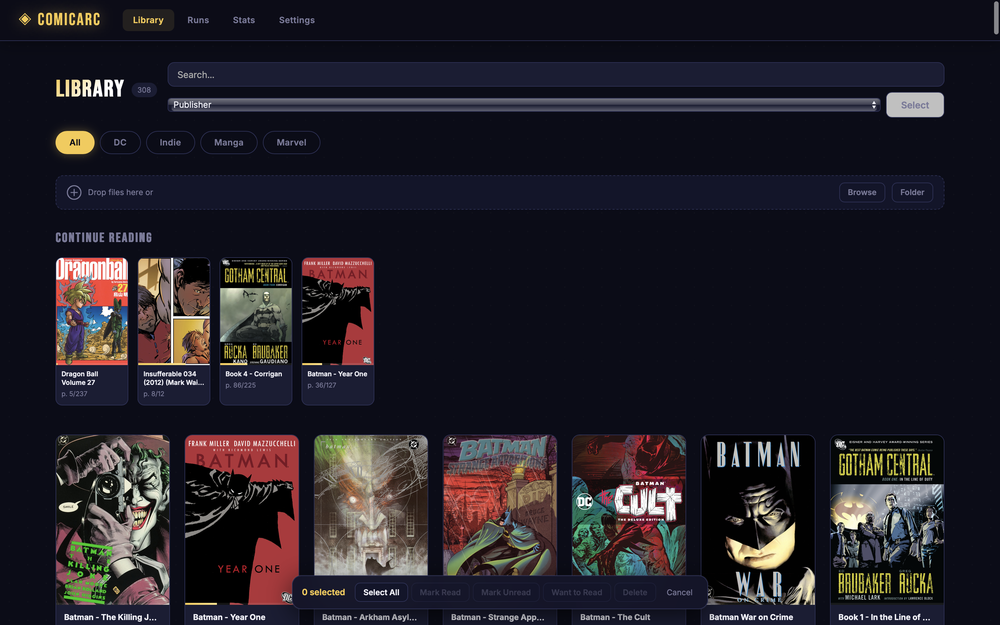
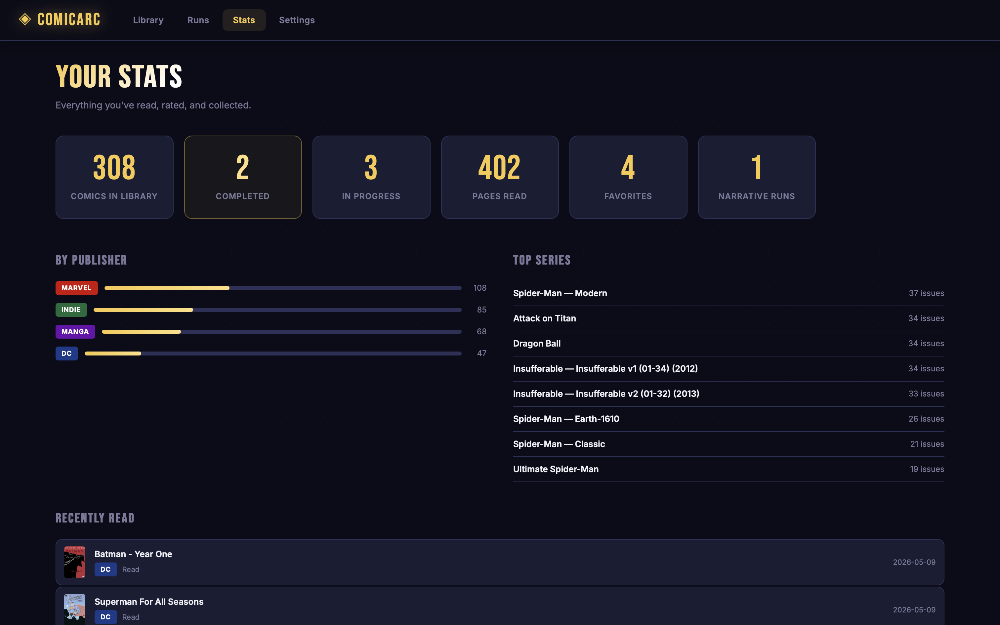

# ComicArc

**A local comic book reader for macOS and Windows. No accounts. No cloud. No subscriptions.**

Organize and read your CBZ, CBR, PDF, and image files in a clean, fast native app that lives entirely on your machine.

---

## Download

**[→ Download ComicArc v1.0.0](https://github.com/Vivekmurugulla2004/ComicArc/releases/latest)**

| Platform | File | Requirements |
|----------|------|--------------|
| macOS | `ComicArc-macOS.zip` | macOS 11.0 (Big Sur) or later — Apple Silicon native, Intel via Rosetta 2 |
| Windows | `ComicArc-Windows.zip` | Windows 10 or later |

---

## FAQ

**Why use this instead of just opening files normally?**

Finder opens files — ComicArc tracks your library. It remembers where you left off in every comic, lets you rate and tag issues, build multi-series reading runs, and see your reading history. No account, no internet, no subscription. Your files stay exactly where they are and are never modified.

**Where do I get comics? Does the app come with any?**

No built-in comics — you bring the files. Legal places to get them:

- **[DriveThruComics](https://www.drivethrucomics.com/)** — DRM-free CBZ/PDF, frequent sales
- **[Humble Bundle](https://www.humblebundle.com/)** — regular comic bundles as DRM-free files
- **[ComiXology](https://www.comixology.com/) / Amazon Kindle** — buy issues or collections
- **Your local library** — free digital comics via [Hoopla](https://www.hoopladigital.com/) or [Libby](https://libbyapp.com/)
- **[Internet Archive](https://archive.org/details/comics)** — public domain comics, free to download

> Only import files you legally own or have the right to use. See [LEGAL.md](LEGAL.md).

---

## Quick Start

**macOS**
1. Download and unzip `ComicArc-macOS.zip`
2. Move **ComicArc.app** to your **Applications** folder
3. **Right-click → Open** (required the first time — see below)
4. Follow the setup wizard and done

**Windows**
1. Download and unzip `ComicArc-Windows.zip`
2. Run **ComicArc.exe** inside the folder
3. Follow the setup wizard and done

No Python, no Terminal, no configuration files.

---

## Opening for the First Time (macOS Gatekeeper)

Because ComicArc is not from the App Store, macOS will warn you on first launch. This is normal for any independently distributed Mac app.

1. Right-click (or Control-click) **ComicArc.app** in Applications
2. Choose **Open** from the menu
3. Click **Open** in the dialog

You only need to do this once.

**If you see "ComicArc is damaged and can't be opened"**, run this in Terminal:

```sh
xattr -cr /Applications/ComicArc.app
```

Then right-click → Open again.

---

## Features

### Library



- Drag-and-drop or folder import — CBZ, CBR, PDF, JPG, PNG
- Grid view with cover thumbnails, progress bars, and star ratings
- **Continue Reading** shelf on the home page
- Filter by publisher tabs, tag chips, or free-text search
- Favorites and **Want to Read** reading queue
- Bulk select — shift-click, select all, mark read/unread, add to list, delete
- Drag-to-reorder cards with automatic Manual Order mode
- Metadata editor — title, series, publisher, issue number, tags

### Reader


- **Page-by-page** mode — click/tap or keyboard to advance
- **Vertical scroll** mode — continuous strip for manga
- **Double-page spread** mode
- Zoom (up to 5×) with click-and-drag panning
- **Autoplay** — advances every 10 seconds with a visible countdown bar
- Auto-hiding toolbar — fades after 3 seconds, returns on mouse move; press `M` to toggle manually
- In-reader keyboard shortcut reference (press `?`)
- Progress saves automatically on every page turn and on close

### Narrative Runs


- Build ordered reading paths that span multiple series and publishers — like a playlist for comics
- Drag-and-drop to reorder issues within a run
- Per-issue notes, ratings, and favorites inline
- Resume button picks up exactly where you left off
- Auto-advances to the next comic when you finish an issue

### Stats



- Total comics, pages read, favorites, in-progress count, run count
- Publisher breakdown with visual bar chart
- Top series by issue count
- Recently read history

### Settings
- Change library folder and rescan at any time
- Switch default reading mode (page-by-page or scroll)
- **CBR support** — one-click install from Settings (macOS: `unar` via Homebrew, Windows: 7-Zip)
- Export full library as a JSON backup — comics, progress, ratings, tags, runs, reading list
- Clear Library — wipes app data, leaves your files untouched

---

## Supported Formats

| Format | Notes |
|--------|-------|
| `.cbz` | Built-in |
| `.cbr` | One-time setup in Settings → CBR Support |
| `.pdf` | Built-in |
| `.jpg` / `.jpeg` / `.png` | Built-in |

CBZ, PDF, and images work immediately. CBR requires a one-time setup — `unar` on macOS, 7-Zip on Windows — both installable from inside the app.

---

## Keyboard Shortcuts

Press `?` in the reader to see these at any time.

| Key | Action |
|-----|--------|
| `←` `→` | Previous / next page |
| `Space` | Next page |
| `Home` | Jump to first page |
| `End` | Jump to last page |
| `V` | Toggle vertical scroll mode |
| `D` | Toggle double-page spread |
| `Z` | Toggle zoom |
| `A` | Toggle autoplay |
| `M` | Show / hide toolbar |
| `?` | Keyboard shortcut reference |
| `Esc` | Exit zoom / stop autoplay / close modal |

**Touch:** swipe left/right to navigate, or tap the left/right edge of the screen.

---

## Your Data

Everything stays on your machine. Nothing is uploaded anywhere.

**macOS**
| What | Location |
|------|----------|
| Library database | `~/Library/Application Support/ComicArc/comics.db` |
| Cover thumbnails | `~/Library/Application Support/ComicArc/covers/` |
| Settings | `~/Library/Application Support/ComicArc/config.json` |

**Windows**
| What | Location |
|------|----------|
| Library database | `%APPDATA%\ComicArc\comics.db` |
| Cover thumbnails | `%APPDATA%\ComicArc\covers\` |
| Settings | `%APPDATA%\ComicArc\config.json` |

Your comic files are **never moved, renamed, or modified.**

---

## Acknowledgements

- [PyWebView](https://pywebview.flowrl.com/) — native window
- [Flask](https://flask.palletsprojects.com/) — local HTTP server
- [PyMuPDF](https://pymupdf.readthedocs.io/) — PDF rendering
- [Waitress](https://docs.pylonsproject.org/projects/waitress/) — WSGI server
- [PyInstaller](https://pyinstaller.org/) — macOS app bundling
- [Inter](https://rsms.me/inter/) and [Bebas Neue](https://fonts.google.com/specimen/Bebas+Neue) — bundled fonts

---

## Legal

Personal use only. Read [LEGAL.md](LEGAL.md) before using.

## License

MIT — see [LICENSE](LICENSE). The license covers the software only, not any content you import.
